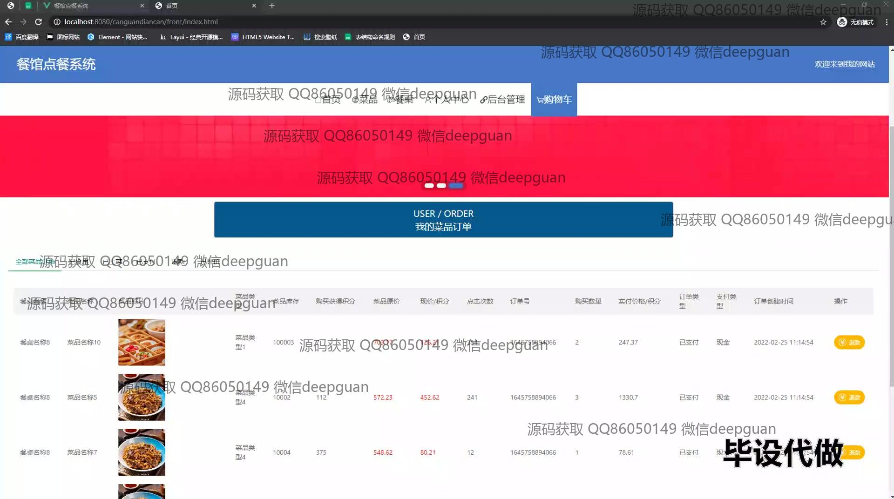

<h1 align="center">基于vue框架的点餐系统的设计与实现+vue</h1>

## 简介
基于Vue框架的餐馆点餐系统：角色分为管理员、用户；提供用户注册、登录、购物车管理、订单管理、会员等级管理、菜品管理、用户信息管理等功能，界面简洁直观。    --计算机毕业设计源码；毕设源码；java毕业设计源码

## 联系方式

<h3 align="center">获取完整代码与数据库文件 + 微信：deepguan QQ: 86050149 QQ群: 783742310</h3>

<h3 align="center">可帮忙远程部署 包运行成功！提供远程部署、修改代码、设计文档指导、代码讲解等服务！</h3>

## 功能介绍（完整见运行截图）
管理员：登录，注册和退出功能使管理员可以安全地访问系统。在后台，管理员可以管理导航栏和主页内容，如菜单、订单、餐桌和个人中心。菜单管理、订单管理、用户信息管理和会员等级管理等功能提高了系统的数据管理能力，包括增加、修改、删除和查看详细信息。终端管理支持查看用户活动，重置密码和角色分配，确保系统高效运行和用户账户安全。

用户：用户可通过注册和登录进入系统，随后访问主页、个人中心和购物车等模块。在个人中心，用户能够管理个人信息，如用户名、联系方式和账户余额，提升个性化体验。用户可以浏览和搜索菜单，查看商品详情，添加商品至购物车，并进行结算。订单管理允许用户查看和管理购买记录，支持退货及支付状态查询，在线点餐及支付模拟功能简化消费流程，进一步增强了用户体验的便捷性和流畅性。

## 运行截图

本代码来源于网络,仅供学习参考使用!

